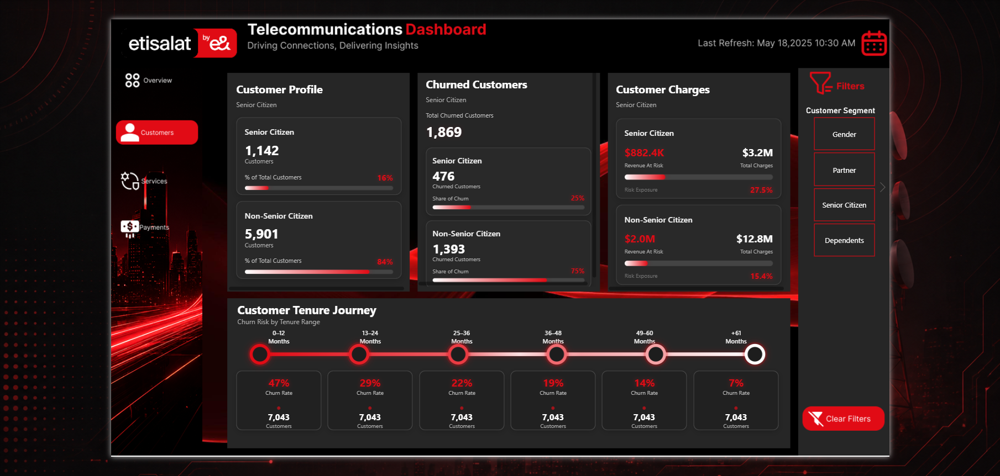

# 📊 ETISALAT CUSTOMER CHURN & REVENUE RISK ANALYTICS

## Customer Churn | Revenue Exposure | Services | Payments | Customer Behavior

An interactive **Power BI telecom analytics solution** designed to turn customer-level data into a clear view of **churn behavior, revenue exposure, service adoption, payment behavior, and customer retention risk**.

---

## 🖥️ Dashboard Experience

### 1. 🏠 Landing Page


### 2. 📊 Overview


### 3. 👥 Customers



### 4. 📱 Services


### 5. 💳 Payment


---

## 🎯 Project Objective

The objective was to build a business-focused telecom dashboard that answers:

- How large is the customer base?
- How many customers have churned?
- What is the overall churn rate?
- How much customer revenue is exposed to churn?
- Which customer characteristics are associated with churn?
- How do services relate to customer behavior and revenue risk?
- How do payment methods differ across customers?
- Where can retention analysis be focused?

The dashboard connects **customer, contract, service, payment, and churn data** into one analytical experience.

---

## 📈 Data at a Glance

| Metric | Value |
|---|---:|
| 👥 Total Customers | **7,043** |
| 📉 Churned Customers | **1,869** |
| 📊 Overall Churn Rate | **26.54%** |
| 💰 Total Charges | **$16.06M** |
| ⚠️ Revenue at Risk | **$2.86M** |
| 📌 Revenue at Risk | **17.83%** |
| 🗂️ Analytical Excel Tables | **5** |

### Dataset Structure

- `dim_customer.xlsx`
- `dim_contract.xlsx`
- `dim_payment.xlsx`
- `dim_services.xlsx`
- `fact_churn.xlsx`

---

# 🔍 Business Analysis & Key Insights

## 1. 💰 Revenue Risk

The analysis connects customer churn with financial exposure instead of treating churn as only a customer-count KPI.

- **1,869 customers** are recorded as churned.
- Overall churn rate is **26.54%**.
- Total customer charges reach approximately **$16.06M**.
- Approximately **$2.86M** is associated with churned-customer revenue exposure.
- Revenue at risk represents approximately **17.83%** of total charges.

This highlights why retention analysis should consider both **customer volume and customer value**.

---

## 2. 👥 Customer Analysis

The Customers page analyzes:

- Total, churned, and retained customers
- Churn rate and retention
- Customer segmentation
- Customer characteristics
- Revenue exposure across customer groups
- Customer lifecycle behavior

The analytical question moves from **“How many customers churned?”** toward **“Which customer groups contribute to churn and revenue exposure?”**

---

## 3. 📱 Services Analysis

The Services page connects:

**Service Adoption → Customer Behavior → Churn → Revenue Risk**

It examines service adoption, customer behavior, churn patterns, and financial exposure across service groups.

This provides context for identifying service configurations that deserve deeper retention investigation.

---

## 4. 💳 Payment Analysis

The Payment page evaluates payment behavior as another dimension of churn analysis.

It examines:

- Payment-method distribution
- Customer behavior by payment method
- Churn patterns across payment groups
- Revenue exposure by payment segment

---

## 5. 📋 Contract & Lifecycle Analysis

Contract information is used to compare customer relationships across:

- Month-to-month contracts
- One-year contracts
- Two-year contracts
- Customer tenure
- Churn behavior
- Revenue exposure

This adds lifecycle context to the overall retention analysis.

---

# 📊 Executive KPI Snapshot

| KPI | Business Meaning |
|---|---|
| **7,043 Customers** | Size of the analyzed customer base |
| **1,869 Churned** | Customers recorded as leaving |
| **26.54% Churn Rate** | Overall customer attrition level |
| **$16.06M Total Charges** | Total customer charge value |
| **$2.86M Revenue at Risk** | Charges associated with churned customers |
| **17.83% Revenue at Risk** | Share of total charges exposed to churn |

The Overview page provides the executive layer, while Customers, Services, and Payment provide the supporting analytical detail.

---

# ⚙️ End-to-End BI Workflow

### 1. Data Preparation
Structured Excel tables were prepared for analytical use.

### 2. Power Query
Used for data cleaning, transformation, data-type management, and column preparation.

### 3. Data Modeling
The model connects customer, contract, payment, service, and churn information.

### 4. DAX
Measures cover customer KPIs, churn, retention, revenue, Revenue at Risk, segmentation, contract, service, and payment analysis.

### 5. Visualization
The final report presents the analysis through an executive-oriented Power BI experience.

---

# 🧠 Analytical Approach

**Customer Base → Churn Behavior → Revenue Exposure → Service Context → Payment Context → Retention Risk**

This structure connects descriptive reporting with business-oriented customer-risk analysis.

---

# 🗂️ Data Model

The model is organized around structured dimension and fact tables:

- **dim_customer** — customer-level attributes
- **dim_contract** — contract structure
- **dim_payment** — payment-method information
- **dim_services** — service attributes
- **fact_churn** — churn and analytical fact data

This structure supports reusable DAX measures and interactive filtering.

---

# 🎨 Dashboard Design & UX

The dashboard was designed as an **executive-style analytical experience** rather than a collection of disconnected charts.

### Design Principles

- Clear KPI hierarchy
- Consistent visual language
- Business-focused navigation
- Customer-risk storytelling
- Revenue-impact visibility
- Interactive filtering

### Design Tools

- **Power BI**
- **Figma**
- **HTML**
- **CSS**

---

# 🧩 Analytical Challenges

### Churn vs. Revenue Risk

Customer churn and financial exposure are not identical measures. The project therefore separates:

**Customer Churn → Revenue at Risk**

### Multi-Dimensional Analysis

Churn is investigated across:

- Customer characteristics
- Contract
- Services
- Payment
- Customer lifecycle

### Business Storytelling

The dashboard follows:

**What is happening? → Where is it happening? → Which customers are involved? → What is the financial exposure?**

---

# 🛠️ Technology Stack

- **Microsoft Power BI**
- **DAX**
- **Power Query**
- **Microsoft Excel**
- **Figma**
- **HTML**
- **CSS**

---

# 📁 Repository Structure

```text
Etisalat-Dashboard/
│
├── Dataset/
│   ├── dim_contract.xlsx
│   ├── dim_customer.xlsx
│   ├── dim_payment.xlsx
│   ├── dim_services.xlsx
│   └── fact_churn.xlsx
│
├── Screenshots/
│   ├── Landing Page.png
│   ├── Overview Page.png
│   ├── Customers.png
│   ├── Services Page.png
│   ├── Payment Page.png
│   └── Model.png
│
├── Etisalat.pbix
├── LICENSE
└── README.md
```

---

# 🎯 Project Outcome

**Customer Data → Data Preparation → Data Model → DAX Measures → KPI Analysis → Interactive Power BI Dashboard**

The result is a telecom analytics solution that connects **customer behavior with financial exposure**, providing a structured foundation for churn and retention analysis.

---

# 👨‍💻 Author

**Kerelos Nakhla**

Data Analyst | BI Developer

**Core Skills:** Power BI · DAX · Power Query · Excel · Data Modeling · Data Analysis · Business Intelligence

#PowerBI #DataAnalytics #CustomerChurn #TelecomAnalytics #DAX #PowerQuery #BusinessIntelligence #DataVisualization #CustomerRetention #RevenueRisk #DataAnalysis #Etisalat
